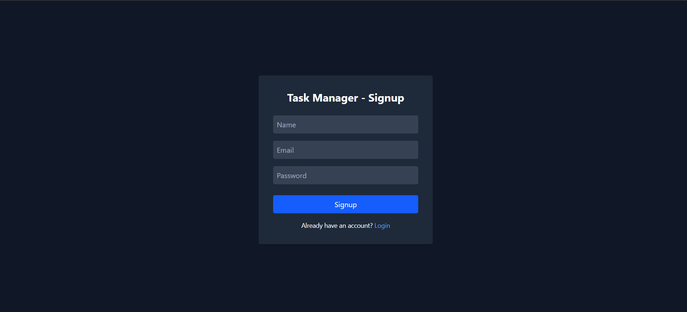
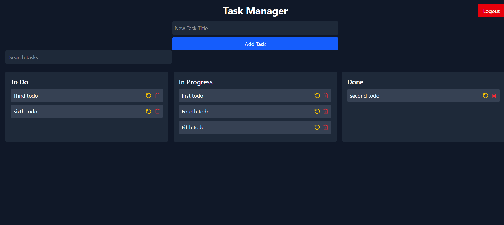

# 📝 Task Manager Web App

A full-stack Task Manager application where users can sign up, log in, and manage their tasks. Tasks are grouped by status (To Do, In Progress, Done), and users can add, edit, delete, and search through tasks.

---

## 🚀 Features

- 🔐 User authentication (JWT + bcrypt)
- ✅ Create, update, delete tasks
- 🔄 Task status flow: To Do → In Progress → Done
- 🔍 Search/filter tasks
- 🖊️ Edit task titles inline
- 🌓 Dark mode UI with mobile responsiveness
- 🧠 Built with Sequelize + MySQL (SQL Edition)

---

## 🛠 Tech Stack

### 🔙 Backend

- Node.js + Express.js
- Sequelize ORM + MySQL
- JWT Authentication + bcrypt
- CORS + dotenv

### 🔜 Frontend

- React.js (Vite)
- Tailwind CSS (Dark mode)
- Axios
- React Router DOM
- Lucide React Icons

---

## 🌐 Live Demo

> _Coming Soon!_ (Will update once deployed to Vercel + Render)

---

## 🖥️ Screenshots





---

## ⚙️ Getting Started

### 1️⃣ Clone the Repo

```bash
git clone https://github.com/Priyanshu-010/Task-manager.git
cd Task-manager

### 🔙 Backend Setup

cd backend
npm install

### Create a .env file in the backend folder and add:

DB_USERNAME=root
DB_PASSWORD=your_mysql_password
DB_NAME=task_manager
DB_HOST=127.0.0.1
JWT_SECRET=your_jwt_secret
PORT=5000

### Then start the backend:

npm start

### 🔙 Frontend Setup

cd ../frontend
npm install
npm run dev

🙋‍♂️ Author
Made with ❤️ by Priyanshu Rai
Github : https://github.com/Priyanshu-010
LinkedIn : https://www.linkedin.com/in/priyanshuraidev

